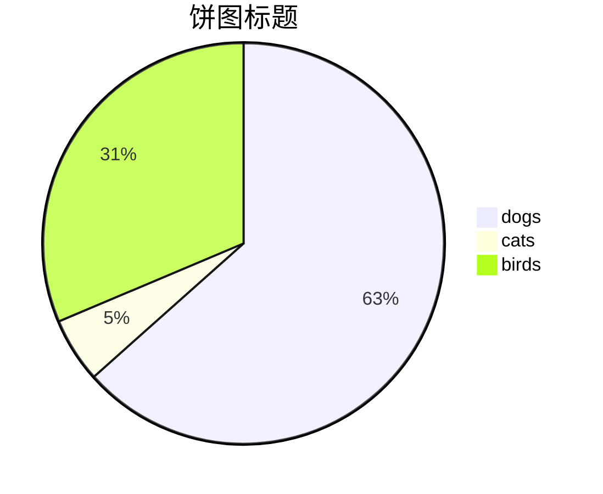

<center>使用技巧</center>

<p align='right'>右对齐</p>

<kbd><span style="color:red;font-size:1.2rem;background:yellow;">red</span></kbd>

<ruby>汉<rt>han</rt></ruby>

<kbd>Ctrl</kbd>+<kbd>F9</kbd>

<span style='display:none'>222</span>

\## <a name="anchor"></a> Header 2 <span style="display:none">I am hidden after export</span>

<audio src="xxx.mp3" />

HTML entities like &reg; &#182;

```Markdown
<video src="xxx.mp4" />
```

<details>     <summary>I have keys but no locks. I have space but no room. You can enter but can't leave. What am I?</summary>     A keyboard. </details>

<blockquote class="twitter-tweet"><p lang="en" dir="ltr">Sunsets don&#39;t get much better than this one over <a href="https://twitter.com/GrandTetonNPS?ref_src=twsrc%5Etfw">@GrandTetonNPS</a>. <a href="https://twitter.com/hashtag/nature?src=hash&amp;ref_src=twsrc%5Etfw">#nature</a> <a href="https://twitter.com/hashtag/sunset?src=hash&amp;ref_src=twsrc%5Etfw">#sunset</a> <a href="http://t.co/YuKy2rcjyU">pic.twitter.com/YuKy2rcjyU</a></p>&mdash; US Department of the Interior (@Interior) <a href="https://twitter.com/Interior/status/463440424141459456?ref_src=twsrc%5Etfw">May 5, 2014</a></blockquote> <script async src="https://platform.twitter.com/widgets.js" charset="utf-8"></script>

<!-- I am some comments not end, not end... here the comment ends -->

<iframe height='265' scrolling='no' title='Fancy Animated SVG Menu' src='//codepen.io/jeangontijo/embed/OxVywj/?height=265&theme-id=0&default-tab=css,result&embed-version=2' frameborder='no' allowtransparency='true' allowfullscreen='true' style='width: 100%;'>See the Pen <a href='https://codepen.io/jeangontijo/pen/OxVywj/'>Fancy Animated SVG Menu</a> by Jean Gontijo (<a href='https://codepen.io/jeangontijo'>@jeangontijo</a>) on <a href='https://codepen.io'>CodePen</a>. </iframe>

:knife:

[ss]:https://blog.csdn.net/qq_41261251/article/details/102817673

<https://blog.csdn.net/qq_41261251/article/details/102817673>




<sup>shang</sup>^2^

<sub>shang</sub>~2~

H~2~O

X^2^
